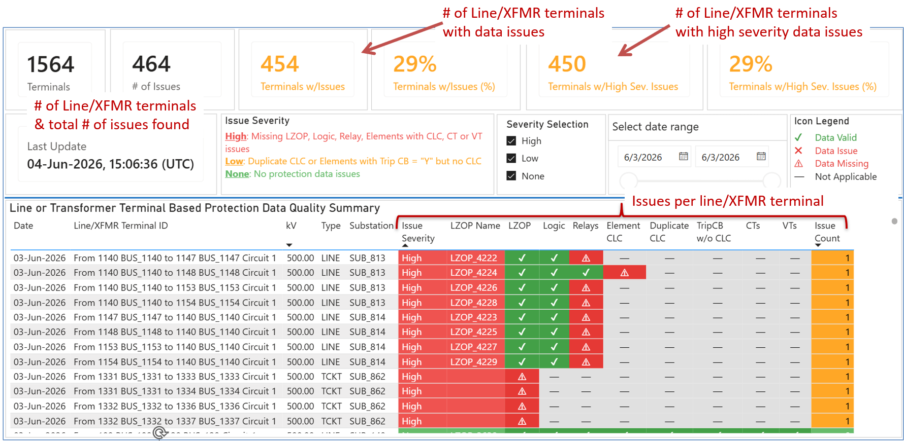

# Protection Data Quality Check

An automated workflow for evaluating protection data model quality in Gridscale X APA,
using APA macros and a Power BI reporting tool.

## Installation and Quickstart

1. Download this repository (`Code -> Download ZIP`)
2. Follow the instructions in `Evaluating Protection Data Model Quality for Coordination Reviews.pdf`

## Technical support

Please contact Grid Integrity Solutions at [info@gridintegritysolutions.com](mailto:info@gridintegritysolutions.com) 
to report bugs, request technical support or provide suggestions for improvements and updates.